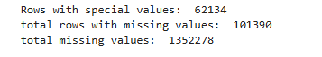

# 🧾 Data Processing & Preparation Steps

## **Step 0 — Understand the Data**

- Loaded the dataset and created a backup copy.
- Reviewed column relationships and formulas (e.g., totals, ratios).
- Goal: understand how variables relate and identify potential data issues.

---

## **Step 1 — Data Cleaning**

### **1.1 Handle Missing Grade Counts**

- For grade columns (`PK` → `AE`), rows where the sum equals `TOTAL` were identified.    
- Missing grade values in those rows were filled with **0**.
- Reason: ensures internal consistency when totals already match.
![[Deliverable 2-1.png]]

---

### **1.2 Remove Rows & Columns with Excessive Missing Data**

- Dropped rows with more than **55% missing values**.
- Dropped columns with more than **40% missing values**.
- Reason: reduces noise and unreliable information.
![[Deliverable 2-3.png]]

---

### **1.3 Replace Placeholder Codes**

- Replaced special codes (`-1, -2, -9, M, N`) with `NaN`.
- Reason: these represent missing or invalid data, not real values.
  ![[Deliverable 2-4.png]]
  ![[Deliverable 2-5.png]]

---

### **1.4 Impute and Fix Discrete Fields**

- Fixed ZIP codes by restoring leading zeros.
- Filled missing address/phone info with placeholders ("Unknown").
- Handle "FRELCH", "REDLCH", "TOTFRL" and "TOTAL" by the relationship between "TOTFRL" and "TOTAL".
    ![[Deliverable 2-6.png]]
- Converted key columns (e.g., `DIRECTCERT`, `FRELCH`) to numeric.
- Reason: ensure correct data types and usability.
  ![[Deliverable 2-7.png]]
   

---

### **1.5 Ensure Race & Enrollment Consistency**

- Converted race columns to numeric.
- Drop the ones that missing all the race counts.
- Checked whether race totals match overall totals.
- Imputed missing gender counts using median ratios.
  ![[Deliverable 2-8.png]]
- Adding features for indicating the total matches the genders add up ("TOTAL_RACE_CONS")
- Adding features for indicating the total matches the genders add up ("TOTAL_GRADE_CONS").
  ![[Deliverable 2-9.png]]
- Reason: maintain logical consistency across demographic data.

  ![[Deliverable 2-10.png]]

---

### **1.6 Recalculate / Fill Derived Values**

- Filled missing `STUTERATIO` using `TOTAL / FTE` when possible.
- Reason: preserve a key analytical variable.
  ![[Deliverable 2-11.png]]
  

---

### **1.7 Handle Edge Cases**

- Investigated potential outliers (IQR method) for `STUTERATIO`.
- Reason: detect unrealistic values.
  ![[Deliverable 2-12.png]]

---

## **Step 2 — Feature Processing**

### **2.1 Remove Low-Variance Features**

- Used `VarianceThreshold = 0.3` to drop nearly constant numeric features.
- Reason: these features add little predictive value.
![[Deliverable 2-13.png]]

---

### **2.2 Correlation Analysis**

- Computed Pearson correlation on numeric predictors.
- Excluded target (`STUTERATIO`) from correlation detection.
- Removed highly correlated features to reduce duplicate information.
- Reason: improves model stability and interpretability.
  ![[Deliverable 2-14.png]]

---

### **2.3 Final Data Check**

- Verified dataset shape and remaining missing values.
- Ensured cleaning steps worked as expected.
  ![[Deliverable 2-15.png]]    

---

## **Step 3 — Transformation & Scaling**

- Applied (or planned) **log transformations** for skewed count features.
- Considered standardization for modeling.
  `trans_cols = ["TOTFRL", "REDLCH", "PK", "KG", "G06", "G09", "G13", "UG", "AE", "STUTERATIO", "AMALM", "ASALM", "BLALM", "HPALM", "TRALM", "WHALM"]`
- Reason: improve distribution symmetry and model performance.
  ![[Deliverable 2-17.png]]![[Deliverable 2-18.png]]![[Deliverable 2-19.png]]![[Deliverable 2-20.png]]
  ![[Deliverable 2-21.png]]  ![[Deliverable 2-22.png]]  ![[Deliverable 2-23.png]]  ![[Deliverable 2-24.png]]  ![[Deliverable 2-25.png]]  ![[Deliverable 2-26.png]]  ![[Pasted image 20260216151140.png]]![[Deliverable 2-27.png]]![[Deliverable 2-28.png]]![[Deliverable 2-29.png]]![[Deliverable 2-30.png]]![[Deliverable 2-31.png]]![[Deliverable 2-32.png]]  ![[Deliverable 2-33.png]]![[Deliverable 2-34.png]]
  ### After log transformation:
  the ones that need: "TOTFRL", "REDLCH", "PK", "KG", "G06", "G09", "G13", "UG", "AE", "STUTERATIO", "AMALM", "ASALM", "BLALM", "HPALM", "TRALM", "WHALM"
  ![[Deliverable 2-35.png]]  ![[Deliverable 2-36.png]]![[Deliverable 2-37.png]]![[Deliverable 2-38.png]]![[Deliverable 2-39.png]]![[Deliverable 2-40.png]]![[Deliverable 2-41.png]]![[Deliverable 2-42.png]]![[Deliverable 2-43.png]]![[Deliverable 2-44.png]]![[Deliverable 2-45.png]]![[Deliverable 2-46.png]]![[Deliverable 2-47.png]]![[Deliverable 2-48.png]]![[Deliverable 2-49.png]]![[Deliverable 2-50.png]]  
---

## **Step 4 — Export Clean Dataset**

- Saved the cleaned dataset to CSV.
- Purpose: ready for modeling or analysis.
  ![[Deliverable 2-16.png]]
