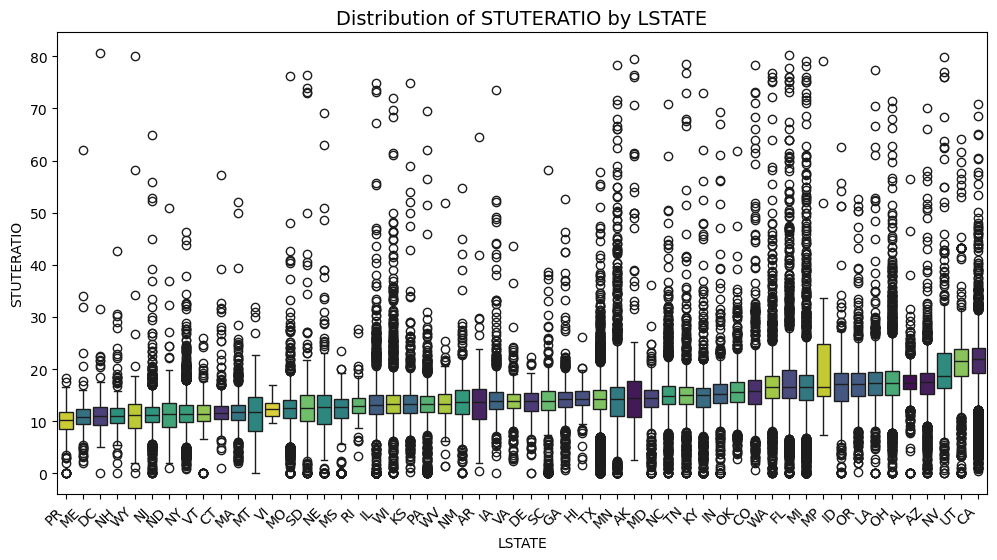
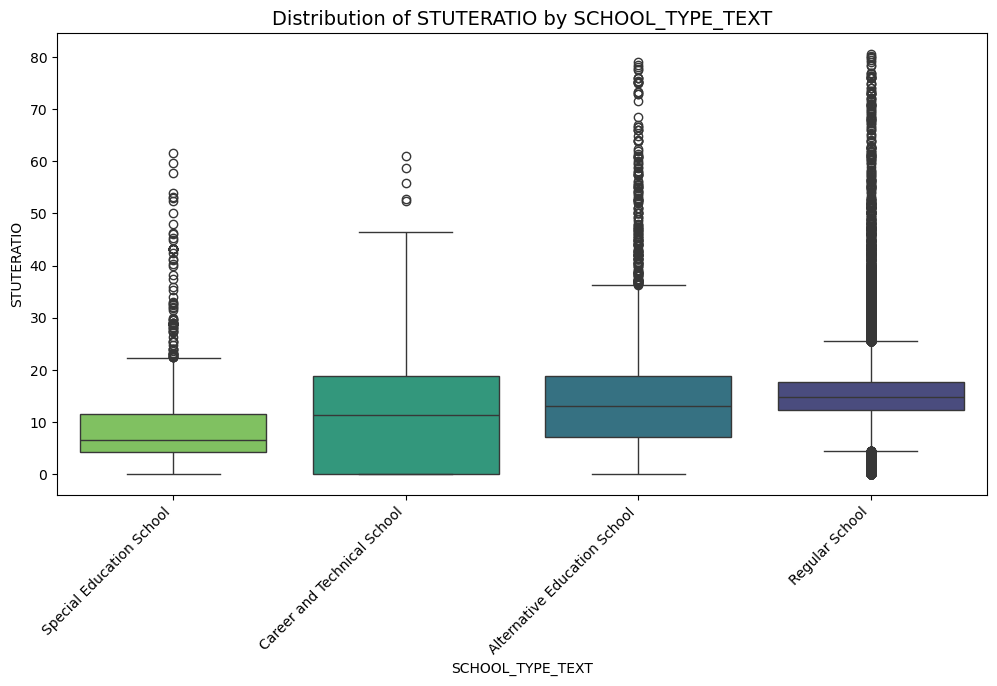
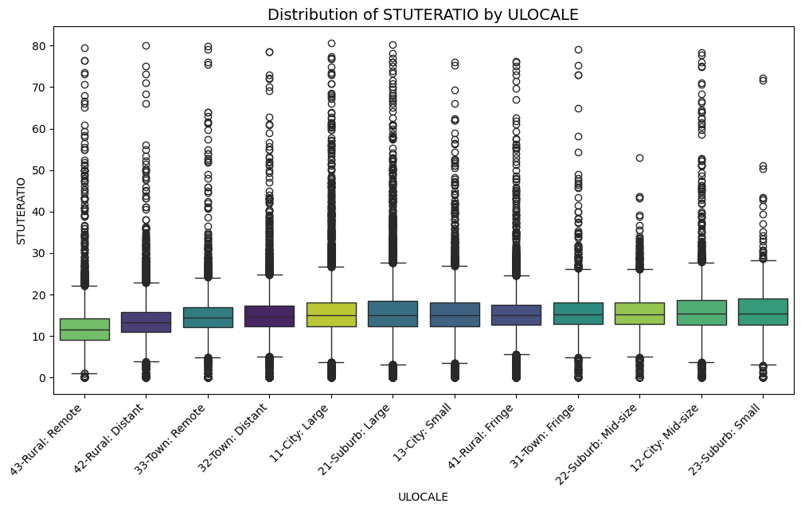
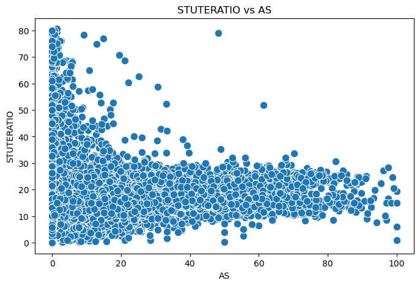
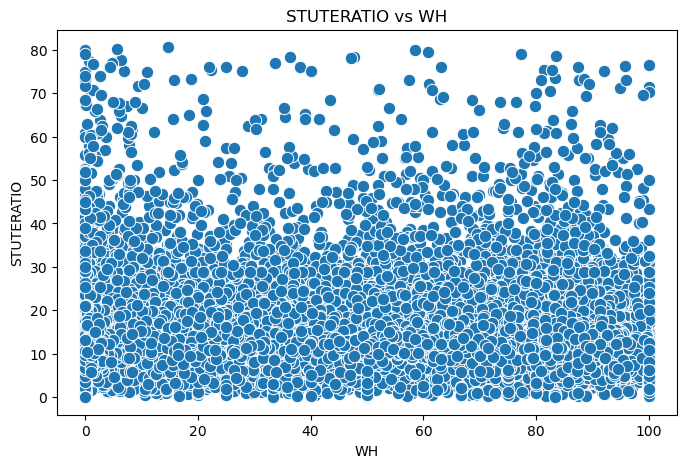

## Graphs

## Statistical Inference
### 1. State-Level Variance Analysis

**Insight:** Certain states deviate significantly from the national student-teacher ratio average.

**Explanation:** We performed a series of **one-sample t-tests** comparing each state's mean `STUTERATIO` against the population mean ($15.14$). By calculating **95% Confidence Intervals**, we identified which states are statistically higher or lower than the benchmark. This helps prioritize resources for states that are currently overburdened.

#### Hypothesis Test Result
Population Average STUTERATIO: 15.14

| **State** | **Status** | **Mean** | **95% Conf. Interval** | **P-Value** |
| --------- | ---------- | -------- | ---------------------- | ----------- |
| **MP**    | HIGHER 📈  | 21.28    | [16.47, 26.09]         | 1.39e-02    |
| **CA**    | HIGHER 📈  | 21.16    | [21.06, 21.27]         | 0.00e+00    |
| **UT**    | HIGHER 📈  | 21.11    | [20.70, 21.53]         | 3.37e-131   |
| **NV**    | HIGHER 📈  | 20.26    | [19.62, 20.89]         | 2.25e-48    |
| **OH**    | HIGHER 📈  | 17.64    | [17.45, 17.82]         | 4.72e-145   |
| **LA**    | HIGHER 📈  | 17.52    | [17.21, 17.82]         | 1.88e-48    |
| **AL**    | HIGHER 📈  | 17.43    | [17.26, 17.60]         | 8.42e-130   |
| **FL**    | HIGHER 📈  | 17.38    | [17.18, 17.58]         | 8.23e-99    |
| **AZ**    | HIGHER 📈  | 17.33    | [17.13, 17.53]         | 3.27e-96    |
| **OR**    | HIGHER 📈  | 17.25    | [16.98, 17.51]         | 4.15e-51    |
| **WA**    | HIGHER 📈  | 17.24    | [17.00, 17.48]         | 1.02e-62    |
| **MI**    | HIGHER 📈  | 16.72    | [16.47, 16.97]         | 5.75e-35    |
| **ID**    | HIGHER 📈  | 16.60    | [16.21, 17.00]         | 1.23e-12    |
| **CO**    | HIGHER 📈  | 16.09    | [15.82, 16.37]         | 2.47e-11    |
| **OK**    | HIGHER 📈  | 15.73    | [15.54, 15.91]         | 6.84e-10    |
| **IN**    | HIGHER 📈  | 15.38    | [15.17, 15.59]         | 2.23e-02    |
| **IA**    | LOWER 📉   | 14.51    | [14.26, 14.76]         | 5.77e-07    |
| **MN**    | LOWER 📉   | 14.36    | [14.07, 14.64]         | 8.84e-08    |
| **GA**    | LOWER 📉   | 14.34    | [14.21, 14.47]         | 1.21e-32    |
| **HI**    | LOWER 📉   | 14.23    | [13.94, 14.53]         | 7.28e-09    |
| **KY**    | LOWER 📉   | 14.19    | [13.89, 14.49]         | 5.63e-10    |
| **TX**    | LOWER 📉   | 14.13    | [14.05, 14.21]         | 2.25e-128   |
| **MD**    | LOWER 📉   | 13.99    | [13.80, 14.18]         | 2.04e-30    |
| **VA**    | LOWER 📉   | 13.84    | [13.73, 13.96]         | 3.14e-99    |
| **WI**    | LOWER 📉   | 13.83    | [13.60, 14.05]         | 2.16e-29    |
| **NM**    | LOWER 📉   | 13.73    | [13.44, 14.03]         | 3.56e-20    |
| **SC**    | LOWER 📉   | 13.65    | [13.41, 13.90]         | 2.25e-30    |
| **DE**    | LOWER 📉   | 13.56    | [13.10, 14.01]         | 7.63e-11    |
| **KS**    | LOWER 📉   | 13.55    | [13.31, 13.79]         | 1.47e-35    |
| **WV**    | LOWER 📉   | 13.45    | [13.20, 13.69]         | 2.40e-37    |
| **PA**    | LOWER 📉   | 13.26    | [13.13, 13.39]         | 8.83e-148   |
| **AR**    | LOWER 📉   | 13.25    | [12.98, 13.53]         | 9.07e-39    |
| **RI**    | LOWER 📉   | 13.16    | [12.87, 13.45]         | 4.53e-33    |
| **IL**    | LOWER 📉   | 13.00    | [12.85, 13.16]         | 8.37e-154   |
| **SD**    | LOWER 📉   | 12.80    | [12.31, 13.28]         | 5.54e-20    |
| **VI**    | LOWER 📉   | 12.51    | [11.59, 13.44]         | 8.45e-06    |
| **NE**    | LOWER 📉   | 12.26    | [11.92, 12.60]         | 2.31e-56    |
| **MO**    | LOWER 📉   | 12.11    | [11.93, 12.28]         | 9.16e-205   |
| **CT**    | LOWER 📉   | 11.99    | [11.79, 12.18]         | 2.00e-154   |
| **MA**    | LOWER 📉   | 11.89    | [11.75, 12.03]         | 1.12e-304   |
| **DC**    | LOWER 📉   | 11.62    | [10.92, 12.32]         | 8.80e-20    |
| **NY**    | LOWER 📉   | 11.56    | [11.47, 11.65]         | 0.00e+00    |
| **NJ**    | LOWER 📉   | 11.48    | [11.34, 11.61]         | 0.00e+00    |
| **VT**    | LOWER 📉   | 11.40    | [10.97, 11.83]         | 2.07e-46    |
| **ND**    | LOWER 📉   | 11.37    | [11.00, 11.74]         | 8.71e-67    |
| **MS**    | LOWER 📉   | 11.33    | [11.03, 11.63]         | 4.42e-107   |
| **MT**    | LOWER 📉   | 11.32    | [11.02, 11.63]         | 3.98e-102   |
| **NH**    | LOWER 📉   | 11.26    | [10.96, 11.57]         | 8.67e-91    |
| **WY**    | LOWER 📉   | 11.23    | [10.63, 11.83]         | 5.05e-31    |
| **ME**    | LOWER 📉   | 10.98    | [10.69, 11.26]         | 1.56e-114   |
| **PR**    | LOWER 📉   | 10.10    | [9.93, 10.27]          | 2.16e-301   |

### 2. Special Education Schools

**Insight:** Special Education schools maintain a significantly lower student-teacher ratio.

**Explanation:** Using a **left-tailed t-test**, we confirmed that these specialized institutions operate with more staff per student to meet high-need requirements. The **p-value ($< 0.05$)** and a confidence interval strictly below the population mean provide statistical proof that this is a structural characteristic of the school type, not a sampling fluke.

#### Hypothesis Test Result
Population Mean: 15.14
Sample size (special schools): 1599
Mean (special schools): 9.31
95% Confidence Interval: [8.90, 9.72]
T-statistic: -27.6258
One-tailed p-value: 5.8988e-138

RESULT: Reject H0
Conclusion: Special education schools have a significantly lower STUTERATIO.
The 95% CI [8.90, 9.72] is entirely below the population mean of 15.14.

### 3. Ungraded Schools

**Insight:** Ungraded schools show lower `STUTERATIO` values than traditional K-12 models.

**Explanation:** We validated this insight through **hypothesis testing**, proving that the non-traditional structure of ungraded schools correlates with smaller class sizes. This suggests that alternative education models may prioritize individual student attention differently than standard grade-level schools.

#### Hypothesis Test Result
Population Mean: 15.14
Sample size (ungraded schools): 134
Mean (ungraded schools): 2.16
95% Confidence Interval for Mean: [1.51, 2.80]
T-statistic: -39.9194
One-tailed p-value: 3.3032e-76

RESULT: Reject H0
Conclusion: Ungraded schools have a significantly lower STUTERATIO.
The confidence interval [1.51, 2.80] confirms the mean is strictly below 15.14.

### 4. Urban + Suburban (ULOCALE) vs Rural Impact

**Insight:** Schools in Cities and Suburbs (ULOCALE 1 & 2) have higher student-teacher ratios than the average.

**Explanation:** A **right-tailed t-test** was used to validate that high-density areas face greater classroom crowding. The results show that urban and suburban centers are statistically more likely to exceed the national average, highlighting a geographic disparity in educational staffing.

#### Hypothesis Test Result (Urban + Suburban)
Population Mean: 15.14
Sample size (City + Suburb): 57823
Mean (City + Suburb): 15.72
95% Confidence Interval for Mean: [15.67, 15.76]
T-statistic: 23.5175
One-tailed p-value: 5.0525e-122

RESULT: Reject H0
Conclusion: City + Suburb schools have a significantly higher STUTERATIO.
The 95% CI [15.67, 15.76] is entirely above the population mean of 15.14.

#### Hypothesis Test Result (Rural)
Population Mean: 15.14
Sample size (Rural): 27949
Mean (Rural): 13.96
95% Confidence Interval: [13.89, 14.02]
T-statistic: -36.9542
One-tailed p-value: 3.3175e-292

RESULT: Reject H0
Conclusion: Rural schools have a significantly lower STUTERATIO.
The 95% CI [13.89, 14.02] is entirely below the population mean of 15.14.

### 5. Asian Student Ratio Stability

**Insight:** When the Asian student ratio exceeds 35%, the `STUTERATIO` becomes more stable.

**Explanation:** Unlike the other checks, this used an **F-Test for Equality of Variances**. We proved that the **Variance ($\sigma^2$)** of this subgroup is significantly lower than the population variance ($31.73$ vs $33.65$). This indicates that these schools have a more "predictable" and consistent staffing model compared to the wider population.

#### Hypothesis Test Result
--- Hypothesis Testing: AS Ratio Stability ---
Variance (AS > 35%): 31.7295
95% CI for Variance: [29.8143, 33.8364]
Variance (Whole Pop): 33.6500

F-statistic:         0.9429
P-value:             0.0379

RESULT: REJECT the Null Hypothesis (H0).
Conclusion: The STUTERATIO is significantly more stable in the high-AS group.
Proof: The entire variance CI is below the population variance of 33.6500.

##### Small Conclusion
We performed an F-test to determine if schools with an Asian student ratio > 35% exhibit more stable Student-Teacher Ratios than the general population. With a variance of 31.73 compared to the population's 33.65, the resulting p-value of 0.0379 allows us to reject the null hypothesis. We can conclude with 95% confidence that the high-AS group is significantly more stable, with its true variance likely falling between 29.81 and 33.84.

### 6. Majority White (WH) Schools (The only one **Failed**)

**Insight:** Schools with a majority White population ($> 50\%$) correlate with lower student-teacher ratios.

**Explanation:** With a massive sample size ($n=48,309$), a **two-tailed t-test** yielded a near-zero p-value ($2.92 \times 10^{-70}$), proving a highly significant downward shift in ratios. The extremely narrow **Confidence Interval ($14.67$ to $14.76$)** provides a precise range that is strictly below the national average of $15.14$.

#### Hypothesis Test Result
Population Mean: 15.14
Sample size (WH > 50%): 48309
Sample Mean: 14.72
95% Confidence Interval: [14.67, 14.76]
T-statistic: -17.7492
Two-tailed p-value: 2.9229e-70

RESULT: Reject H0
Conclusion: WH ratio (>50%) significantly affects STUTERATIO (it is lower).
The 95% CI [np.float64(14.67), np.float64(14.76)] does not contain the population mean 15.14.
